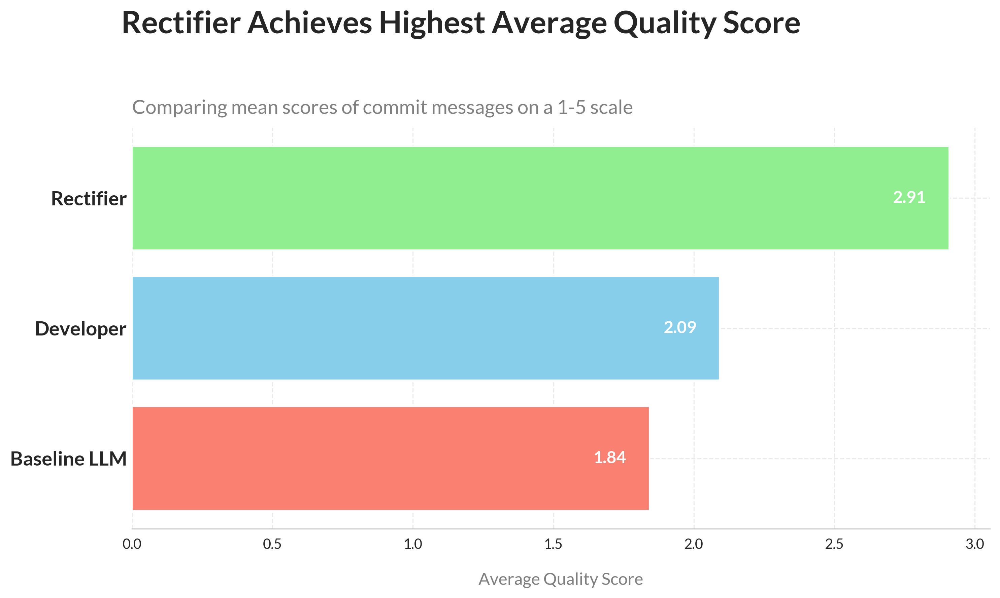

# CS202 Lab 2: Automated Commit Message Rectification Pipeline

## 1. Overview

This project is a complete, production-grade ETL pipeline developed for the "CS202: Software Tools and Techniques" course. Its purpose is to mine the `geocoder` open-source repository, identify bug-fixing commits, and use a series of Large Language Models (LLMs) to automatically evaluate and rectify the quality of their commit messages. The entire framework is designed to be modular, resumable, and professional.

## 2. Key Features

-   **Automated Repository Mining**: Uses `PyDriller` to efficiently extract commit metadata, diffs, and the full source code before and after each change.
-   **Professional & Modular Architecture**: The codebase is strictly organized with a `src` package, a centralized `config.yaml`, and a complete separation of concerns between data processing, LLM interaction, and visualization.
-   **Dual-LLM Analysis Pipeline**:
    -   A baseline T5 model (`mamiksik/CommitPredictorT5`) generates an initial commit message.
    -   An advanced Qwen model (`Qwen/Qwen3-4B-Instruct-2507`) performs three complex tasks:
        1.  **Rectification**: Rewrites messages into the Conventional Commits standard.
        2.  **Evaluation**: Scores the quality of developer, baseline, and rectified messages.
        3.  **Classification**: Categorizes the type of improvement made.
-   **Resumable & Fault-Tolerant**: The pipeline saves its progress to a CSV, allowing it to be stopped and safely resumed. The schema is pre-defined to be robust against data type errors during execution.
-   **Publication-Quality Visualizations**: A separate, dedicated script generates a suite of insightful plots ready for an academic report.

## 3. Setup and Usage

### Step A: Environment Setup

1.  Clone the repository and navigate into the project directory.
2.  Create and activate a Python virtual environment:
    ```bash
    python3 -m venv venv
    source venv/bin/activate
    ```
3.  Install the required dependencies:
    ```bash
    pip install -r requirements.txt
    ```

### Step B: Run the Analysis Pipeline

This will perform the repository mining and all LLM analysis tasks. This process can take several hours depending on your hardware.

```bash
python main.py
```
The script will produce `lab2_results_final.csv` and print a final summary report to the console.

### Step C: Generate the Visualizations

After the main pipeline is complete, run this script to generate the plots.

```bash
python visualize.py
```
This will create a `visuals/` directory containing the three publication-quality PNG files for the report.

## 4. Results Overview

The pipeline confirmed that the Rectifier model significantly improves commit message quality, raising the average score from **2.11 (Developer)** to **2.94 (Rectifier)** on a 5-point scale.



## 5. Technologies Used

-   Python 3.12
-   PyDriller
-   Pandas
-   Hugging Face Transformers
-   PyTorch
-   Matplotlib & Seaborn